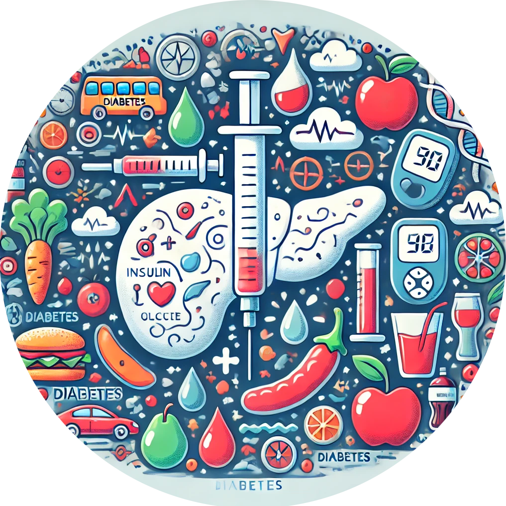

```{r setup, include=FALSE}
knitr::opts_chunk$set(echo = TRUE)
library(runjags)
library(brms)
library(coda)
library(readxl)
library(dplyr)
library(ggplot2)
```

# Introduction

This exercise focuses on predicting diabetes using a dataset provided by the National Institute of Diabetes and Digestive and Kidney Diseases (https://www.kaggle.com/datasets/mathchi/diabetes-data-set). The main goal is to determine whether a patient has diabetes based on various diagnostic features. The dataset contains information about female patients of Pima Indian heritage who are at least 21 years old and includes an additional variable indicating the different zones of the patients, ranging from 'zona1' to 'zona30'.

<div style="float: right; margin-right: 20px; width: 50%;">
  ```{r, echo=FALSE, out.width='100%'}
  
  ```
</div>


The dataset includes a range of medical measurements that are useful in predicting the likelihood of diabetes. These features are:

- **Pregnancies**: Number of times a patient has been pregnant.
- **Glucose**: Plasma glucose levels after an oral glucose tolerance test.
- **BloodPressure**: Diastolic blood pressure (mm Hg).
- **SkinThickness**: Triceps skin fold thickness (mm).
- **Insulin**: 2-Hour serum insulin levels (mu U/ml).
- **BMI**: Body mass index (weight in kg/(height in m)^2).
- **DiabetesPedigreeFunction**: Diabetes pedigree function, representing the patient's hereditary risk.
- **Age**: The patient's age (in years).
- **Zone**: The newly added variable indicating the patient's zone, ranging from 'zona1' to 'zona30'.
- **Outcome**: A binary indicator representing whether the patient has been diagnosed with diabetes (0 or 1).

Explore the relationships between these features using `jags` or `brms` and use them to build a predictive model that can accurately classify patients as having diabetes or not. Understanding these relationships will also provide insights into the contributing factors for diabetes among the Pima Indian female population.


# Data

```{r}
  data_diab <- read_xlsx("diabetes.xlsx")
head(data_diab)
```

# Model specification and fitting

## Write the complete model
Describe the full Bayesian logistic regression model predicting `Outcome` from `Glucose`, `BMI`, and `Age`, including:

- The likelihood for \( y_i \mid \pi_i \),

- The logit link function, and  

- The priors for the regression parameters.

## Fit the model using `brms`
Fit the model and briefly explain your choice of family, formula, and priors.

## MCMC configuration
What values would you choose for `chains`, `iter`, `warmup`, and `seed`?  
Explain why these choices make sense for this model.

## Inspect the model output
Once the model is fitted:

- Which key statistics appear in the summary (e.g., mean, SE, 95% CrI)?  

- Comment on whether the posterior credible intervals exclude zero for any of the covariates.

---

# Convergence diagnostics

## Checking convergence
Generate and describe the main diagnostic measures used to check MCMC convergence.

## Interpretation of diagnostics
What do **Rhat**, **Bulk_ESS**, and **Tail_ESS** indicate about model convergence?

## Trace plots
How would you interpret trace plots that show:

- good mixing (chains overlapping and stable), versus  

- poor mixing (chains separated or trending)?

---

# Hypothesis testing

In this model, we are interested in testing whether higher **Glucose**, **BMI**, or **Age** increase the probability of diabetes.

Formally, for each coefficient \( \beta_j \):
\[
H_0: \beta_j \le 0 \quad \text{vs.} \quad H_1: \beta_j > 0.
\]

## One-sided hypotheses
Explain in words what these one-sided hypotheses mean in the context of the diabetes dataset.

## Using `hypothesis()` in brms
Describe how the `hypothesis()` function computes:

- the posterior probability that \( \beta_j > 0 \) (`Post.Prob`), and  

- the **evidence ratio** comparing the probability of a positive versus non-positive effect.

## Interpretation of results
Interpret the posterior probabilities (`Post.Prob`) and evidence ratios for the variables **Glucose**, **BMI**, and **Age**.  
What does it mean if:

- `Post.Prob ≈ 1`?  

- `Evid.Ratio > 10`?  

How would you report these findings in a clinical context?

## Concluding statement
Based on the posterior evidence, which variables show the strongest support for increasing the probability of diabetes?

---

# Effect sizes: Odds Ratios

## Computing odds ratios
Explain how to obtain odds ratios from the posterior samples of the regression coefficients.

## Interpretation of the odds ratio for Glucose
Compute and interpret the odds ratio for **Glucose**.  
What does this value imply about the change in diabetes odds for a one-unit increase in Glucose?

---

# Prediction

## Posterior predictions
Describe how you would generate posterior predictions for new individuals using the fitted model.

## Patterns of risk
Which combinations of `Glucose`, `BMI`, and `Age` are most likely to yield high probabilities of diabetes?  
Explain how these predictions can be summarized or visualized.

## Quantifying uncertainty
How would you summarize the uncertainty in your predictions?  
Mention both numerical (credible intervals) and graphical options (e.g., posterior predictive intervals).

---

# Random effects by Zone (bonus)

## Motivation
Why might it make sense to include a random intercept for `Zone` in this model?

## Interpretation
If you fit a model with random effects by `Zone`, how would you interpret the standard deviation of the random intercept?

## Model comparison
How could you evaluate whether including `Zone` improves model performance (e.g., using LOO or WAIC)?

---

